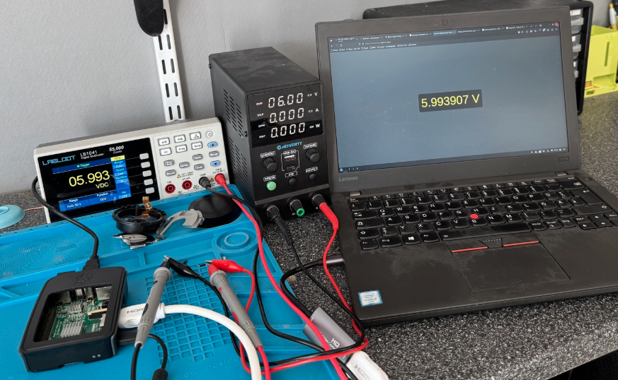

# labloot-reader



## Installation

### Quick-start

To quickly get started with the labloot-reader clone the repository and run the server:

``` sh
# Clone the repository
git clone https://github.com/gbyx3/labloot-reader.git
cd labloot-reader

# On Debian-based system you can install the required dependencies using apt:
apt-get install python3-serial
# For other systems, you can install the required dependencies using pip:
pip install -r requirements.txt

# Run the server with:
python3 server.py
```

This should start the server listening on port 8000

Navigate to [http://127.0.0.1:8000](http://127.0.0.1:8000)

## Labloot instructions

### Communication interface settings

Press the front panel Utility key, press the Next softkey to access the communication interface setting menu.

Press the Baud softkey to select the desired baud rate from 2400, 4800, 9600, 19200, 38400, 57600 or 115200. The default is 115200. Make sure that the baud rate matches that of the computer.

Press the Parity softkey, select the parity from None, Odd or Even. The default is None.

### Baud rate issues

It seems the device resets the baud rate each time you turn it off or on, the correct value is shown in the menu but no connection can be made until the baud rate is reapplied
